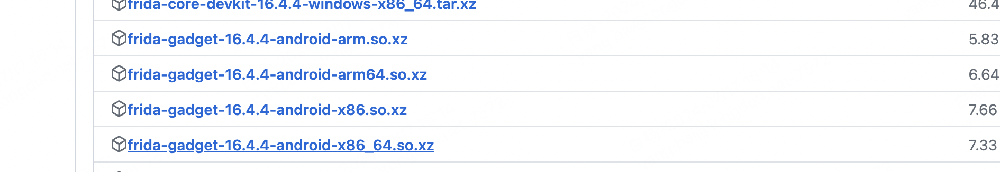
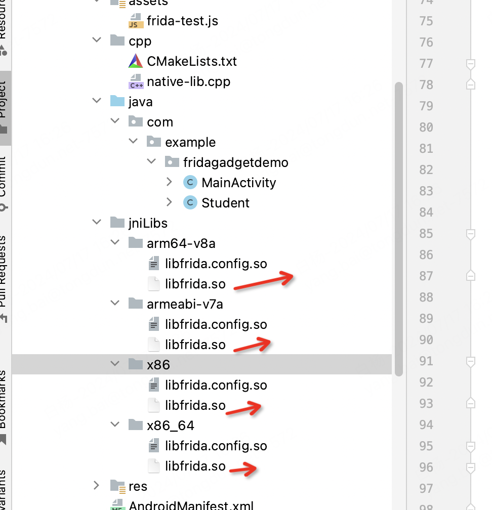
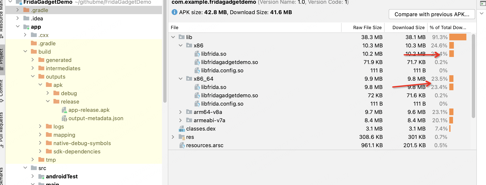

笔记

利用frida-gadget 进行hook，兼容性好，支持4个架构

1.下载frida-gadget相关的so，地址：https://github.com/frida/frida/releases/tag/16.4.4



2.解压下载下来的so，重新命名，本demo 叫libfrida.so,如果针对风控最好不要叫这个名字；

3.把解压好重新命名的so放到jniLibs目录下



4.各个架构新建file文件重新命名为例如上图中libfrida.config.so（注意：名字要和libfrida.so对应）

5.编辑libfrida.config.so文件：就是指定hook脚本的文件路径

```json
{
  "interaction": {
    "type": "script",
    "path": "/data/data/com.example.fridagadgetdemo/files/frida-test.js",
    "on_load": "resume"
  }
}
```

 path脚本路径指定在了我们应用的file文件夹下

`on_load`为`"resume"`，你可以让应用程序在加载脚本后继续运行

6.编写hookjs代码，例如frida-test.js放到我们的assets文件夹目录下

例如：我们编写hook androidid的脚本代码

```js
Java.perform(
    function () {
        //hook android id 方法
        var SettingsSecure = Java.use('android.provider.Settings$Secure');
        SettingsSecure.getString.implementation = function (resolver, name) {
            if (name === "android_id") {
               return "123456789";
            }
            // 调用原始方法
            return this.getString(resolver, name);
        };
    }
);
```

当app获取androidid时hook返回"123456789"

7.demo运行前拷贝frida-test.js到/data/data/com.example.fridagadgetdemo/files/ 下

8.加载frida-gadget.so 既我们重新命名的libfrida.so，代码中调用System.loadLibrary("frida");

9.代码中调用System.loadLibrary("frida");之后会通过libfrida.config.so的path配置找到我们hook的代码并且执行


测试：

验证雷电/夜神/逍遥等模拟器 及真机14都是可以兼容 hook


缺点：so的架构大小较大，一个架构10M左右：



参考：https://frida.re/docs/gadget/


其它：

脚本路径动态指定：针对多开的场景（应用多开，系统多开由于用户id，file路径已变化）
